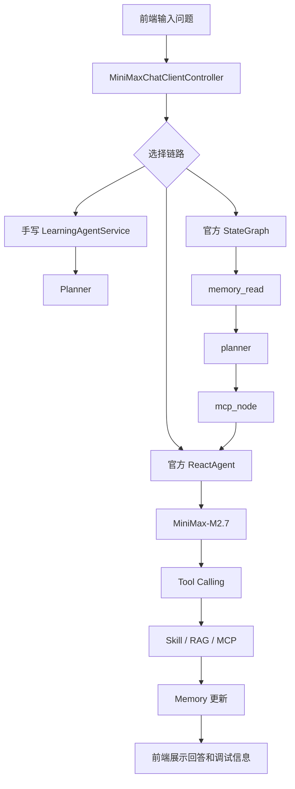

# MiniMax Chat 学习流测试手册

这份文档用于沉淀 `minimax-chat` 当前学习工程的完整测试路径。目标不是只验证“接口能返回”，而是明确看到每一层能力是否真的生效。

## 启动准备

### 只测试基础能力和 Mock MCP

启动 `minimax-chat`：

```bash
cd spring-ai-alibaba-chat-example/minimax-chat
mvn spring-boot:run
```

访问：

```text
http://localhost:8080/index.html
```

### 测试真实 MCP

先启动 MCP Server：

```bash
cd spring-ai-alibaba-chat-example/minimax-learning-mcp-server
mvn spring-boot:run
```

再用 `mcp` profile 启动 `minimax-chat`：

```bash
cd spring-ai-alibaba-chat-example/minimax-chat
mvn spring-boot:run -Dspring-boot.run.profiles=mcp
```

检查：

```text
http://localhost:8080/minimax/chat-client/mcp/status
```

预期：

```json
{
  "realMcpAvailable": true,
  "mode": "REAL_MCP_READY"
}
```

## 总体调用链路



## 测试矩阵

| 阶段 | 测试目标 | 推荐入口 | 观察重点 |
|---|---|---|---|
| 1 | 基础聊天 | `simple/chat` | MiniMax 配置是否可用 |
| 2 | 多轮上下文 | 前端页面 | history 是否参与回答 |
| 3 | Tool Calling | `conversation/chat` | `toolCalls` 是否出现工具 |
| 4 | Skill | `generateDailyPlan` | Tool 是否委托 Skill |
| 5 | Planner | 调试区 | `intent` 是否符合问题 |
| 6 | Memory | `/memory` | `memoryBefore` / `memoryAfter` |
| 7 | RAG | `searchLearningDocs` | 是否检索当前项目资料 |
| 8 | 官方 ReactAgent | `official-agent/chat` | 官方 Agent 是否自主调用 Tool |
| 9 | 官方 StateGraph | `official-graph/chat` | `graphSteps` 是否完整 |
| 10 | Mock MCP | 默认配置 | `mcpDebugInfo.mode=MOCK_MCP` |
| 11 | 真实 MCP | `mcp` profile | `mcpDebugInfo.mode=REAL_MCP` |
| 12 | MCP 可观测性 | 前端调试区 | MCP Tool、fallback、可用工具 |
| 13 | MCP 资源写入 | 前端页面 | `createMcpLearningResource` 写回 MCP Server |

## 1. 基础聊天测试

推荐接口：

```http
GET http://localhost:8080/minimax/chat-client/simple/chat?message=你好，请介绍一下你自己。
```

预期：

```text
返回 MiniMax-M2.7 的普通文本回答。
```

观察：

```text
如果这里失败，优先检查 MINIMAX_API_KEY、base-url、model 配置。
```

对应文件：

```text
minimax-chat.http
```

## 2. 多轮上下文测试

页面入口：

```text
http://localhost:8080/index.html
```

推荐输入第一轮：

```text
我正在学习 Spring AI Alibaba Agent，目标是理解 Tool、Skill、Memory 和 Graph。
```

推荐输入第二轮：

```text
基于我刚才的目标，下一步应该做什么？
```

预期：

```text
第二轮回答能引用第一轮的学习目标。
```

观察：

```text
短期上下文来自前端 history。
长期状态来自 Memory。
```

## 3. Tool Calling 测试

推荐输入：

```text
现在北京时间几点？请说明你是否使用了工具。
```

预期：

```text
toolCalls 中出现 getCurrentTime。
```

重点字段：

```text
toolCalls[0].name = getCurrentTime
toolCalls[0].arguments.zoneId = Asia/Shanghai
```

失败判断：

```text
如果没有 toolCalls，说明模型没有触发工具，优先检查 Tool 描述或提示词。
```

## 4. Skill 调用测试

推荐输入：

```text
我是初学者，请给我一个今天 30 分钟的 Spring AI Alibaba Agent 学习计划。
```

预期：

```text
toolCalls 中出现 generateDailyPlan。
回答内容是结构化学习计划。
```

调用链路：

```text
MiniMaxLearningTools.generateDailyPlan
 -> LearningSkillService.generateDailyPlan
 -> 返回计划内容给模型
```

失败判断：

```text
Tool 出现但内容不对，优先看 Skill。
Tool 没出现，优先看 Planner 和 Tool 描述。
```

## 5. Planner 意图识别测试

推荐输入：

```text
Tool 和 MCP 有什么区别？
```

预期：

```text
调试区识别意图为 CONCEPT_EXPLAIN 或 MIXED。
```

再测试：

```text
基于当前项目，解释 Tool、Skill、Agent、Memory、RAG 和 Graph 的调用关系。
```

预期：

```text
意图应偏向 PROJECT_RAG / MIXED。
```

观察：

```text
Planner 不负责回答，它负责决定后续策略。
```

## 6. Memory 读写测试

写入：

```http
POST http://localhost:8080/minimax/chat-client/conversation/chat
Content-Type: application/json

{
  "userId": "user-a",
  "message": "我是初学者，想学习 Agent。",
  "history": []
}
```

查看：

```http
GET http://localhost:8080/minimax/chat-client/memory?userId=user-a
```

预期：

```text
topics 包含 Agent。
conversationCount 增加。
lastIntent 被更新。
```

多用户隔离测试：

```text
user-a 输入 Agent
user-b 输入 RAG
分别查看 /memory，两个用户状态应该不同。
```

## 7. RAG 检索测试

推荐输入：

```text
根据当前 minimax-chat 项目，解释 Tool、Skill、Agent、Memory、RAG 和 Graph 的调用关系。
```

预期：

```text
toolCalls 中出现 searchLearningDocs。
回答会引用当前项目结构和实现。
```

观察：

```text
RAG 的作用是把当前项目资料提供给模型。
它不是执行动作，而是补充上下文。
```

## 8. 官方 ReactAgent 测试

推荐接口：

```http
POST http://localhost:8080/minimax/chat-client/official-agent/chat
Content-Type: application/json

{
  "userId": "user-a",
  "message": "请通过官方 ReactAgent 告诉我现在北京时间，并给我一个 30 分钟 Agent 学习计划。",
  "history": []
}
```

预期：

```text
agentSteps 中出现 OFFICIAL_REACT_AGENT。
toolCalls 中可能出现 getCurrentTime 和 generateDailyPlan。
```

观察：

```text
官方 ReactAgent 自己决定是否调用 Tool。
```

对应文件：

```text
minimax-official-agent.http
```

## 9. 官方 StateGraph 测试

推荐接口：

```http
POST http://localhost:8080/minimax/chat-client/official-graph/chat
Content-Type: application/json

{
  "userId": "user-a",
  "message": "请用官方 StateGraph 告诉我现在北京时间，并给我一个 30 分钟 Agent 学习计划。",
  "history": []
}
```

预期：

```text
graphSteps 包含：
memory_read
planner
mcp_node
react_agent
memory_write
response
```

观察：

```text
Graph 负责流程编排。
ReactAgent 是 Graph 中的一个节点。
```

## 10. Mock MCP 测试

默认启动 `minimax-chat`，不启用 `mcp` profile。

推荐输入：

```text
通过 MCP 查询 Agent 和 Graph 的学习资源，并说明下一步怎么学。
```

预期：

```text
MCP 调试信息：
模式：MOCK_MCP
真实 MCP 可用：false
Fallback 原因：未发现 Spring AI MCP ToolCallbackProvider...
```

观察：

```text
Mock MCP 用于学习 MCP 的位置，不依赖外部 Server。
```

## 11. 真实 MCP Server 测试

启动 MCP Server：

```bash
cd spring-ai-alibaba-chat-example/minimax-learning-mcp-server
mvn spring-boot:run
```

启动 `minimax-chat`：

```bash
cd spring-ai-alibaba-chat-example/minimax-chat
mvn spring-boot:run -Dspring-boot.run.profiles=mcp
```

检查：

```http
GET http://localhost:8080/minimax/chat-client/mcp/status
```

预期：

```text
mode = REAL_MCP_READY
toolNames 中出现 searchLearningResources
```

推荐输入：

```text
通过真实 MCP Server 查询 Spring AI Alibaba Agent 学习资源。
```

预期：

```text
回答中出现“真实 MCP Server 调用结果”。
MCP 调试信息中 mode = REAL_MCP。
```

对应文件：

```text
../minimax-learning-mcp-server/minimax-learning-mcp-server.http
```

## 12. MCP 可观测性测试

推荐使用页面测试：

```text
http://localhost:8080/index.html
```

选择：

```text
官方 Graph
同步
调试
```

推荐输入：

```text
用官方 Graph 通过 MCP 查询 MCP、Tool 和 Graph 的学习资料。
```

预期调试区：

```text
MCP 调试信息
模式：REAL_MCP
真实 MCP 可用：true
选中 Tool：...searchLearningResources
可用 Tools：...
Fallback 原因：无
```

如果停掉 MCP Server 后再测：

```text
模式：MOCK_MCP
Fallback 原因：真实 MCP 调用失败或未发现 ToolCallbackProvider
```

## 13. MCP 资源写入测试

前置条件：

```text
1. minimax-learning-mcp-server 已启动。
2. minimax-chat 使用 mcp profile 启动。
3. /minimax/chat-client/mcp/status 返回 REAL_MCP_READY。
```

推荐输入：

```text
把 Tool 和 MCP 的区别保存成一条学习资源，资源 ID 用 mcp-tool-vs-mcp，主题用 MCP，标题用 Tool 和 MCP 的区别，摘要说明 Tool 是模型可调用的函数入口，MCP 是把外部工具和资源协议化接入 Agent 的方式，下一步建议是先实现一个 Tool，再通过 MCP Server 暴露给 Agent 调用。
```

预期：

```text
toolCalls 中出现 createMcpLearningResource。
MCP 调试信息 mode = REAL_MCP。
selectedToolName 指向 createLearningResource。
```

验证写入：

```text
http://localhost:19000/index.html
```

应该能看到 `mcp-tool-vs-mcp` 这条学习资源。

也可以直接请求：

```http
GET http://localhost:19000/learning-mcp/resources/mcp-tool-vs-mcp
```

## 快速定位问题

| 现象 | 优先检查 |
|---|---|
| 基础聊天失败 | `MINIMAX_API_KEY`、`base-url`、模型名 |
| 没有 Tool Calls | Tool 描述、系统提示词、Planner 意图 |
| Tool 有调用但内容不对 | Skill Service 或工具参数 |
| Memory 不更新 | `LearningMemoryService`、JSON 文件路径、userId |
| RAG 没触发 | 用户问题是否明确提到当前项目、README、源码、调用链 |
| 官方 Agent 失败 | `OfficialLearningAgentConfiguration`、ToolCallback 注册 |
| Graph 缺节点 | `OfficialLearningGraphService` 节点和边 |
| MCP 是 MOCK_MCP | MCP Server 未启动或 `mcp` profile 未启用 |
| MCP 写入没有落盘 | 确认 `toolCalls` 是否出现 `createMcpLearningResource`，并检查 MCP Server 是否真实连接 |
| MCP Server 启动失败 | 19000 端口、JDK 17、MCP Server 依赖 |
| Maven 报 `--release` | 当前 Maven 绑定 Java 8，需要切到 JDK 17 |

## 推荐学习顺序

```text
基础聊天
 -> Tool Calling
 -> Skill
 -> Planner
 -> Memory
 -> RAG
 -> 官方 ReactAgent
 -> 官方 StateGraph
 -> Mock MCP
 -> 真实 MCP Server
 -> MCP 可观测性
 -> MCP 资源写入
```

这条路线跑通后，可以继续进入下一阶段：把 MCP Server 的资源从内存列表升级为文件、数据库或外部知识库。
